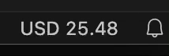

# Live Salary

Live Salary is a Visual Studio Code extension that shows your live-updating salary in the status bar, based on the time you’ve worked. This extension allows you to start and stop shifts, account for time already worked, and customize the hourly rate, currency, and currency placement.

# Features

- **Start Shift:** Begin tracking your salary based on the specified hourly rate.
- **Start Shift with Time Worked:** Start a shift but include the time you've already worked (useful for resuming shifts or pre-recorded work).
- **End Shift:** Stop tracking your salary and remove it from the status bar.
- **Customizable Currency Display:** Choose your currency and whether it appears on the left or right side of the salary amount.
- **Live Salary Updates:** The salary displayed in the status bar updates every second, showing your earnings in real-time.

# Settings

This extension provides several configurable settings to personalize your experience:

- **Hourly Rate (`liveSalary.hourlyRate`):** Set the hourly rate used to calculate your live salary.
  - **Default:** `25`
- **Currency (`liveSalary.currency`):** Choose the currency symbol to display in the status bar (e.g., USD, EUR, $ or €).
  - **Default:** `USD`
- **Currency Position (`liveSalary.currencyPosition`):** Select whether the currency symbol appears to the left or right of the salary value.
  - **Options:** `left`, `right`
  - **Default:** `left`

# Commands

You can access the following commands through the Command Palette (`Cmd + Shift + P` on macOS, `Ctrl + Shift + P` on Windows/Linux):

- **Live Salary: Start Shift (`liveSalary.startShift`):** Starts a new shift and begins displaying the live salary.
- **Live Salary: Start Shift with Time Worked (`liveSalary.startShiftWithTimeWorked`):** Starts a shift with an option to specify how long you've already worked (in minutes).
- **Live Salary: End Shift (`liveSalary.endShift`):** Ends the shift and removes the salary display from the status bar.

# How to Use

1. **Set the Hourly Rate and Currency:**
    - Open your VS Code settings (`Cmd + ,` on macOS, `Ctrl + ,` on Windows/Linux) and search for **Live Salary**.
    - Set your hourly rate and preferred currency.
2. **Start Your Shift:**
    - Open the Command Palette (`Cmd + Shift + P` or `Ctrl + Shift + P`), then type and select **Live Salary: Start Shift** to begin tracking your earnings.
3. **Track Previously Worked Time:**
    - To start with an existing amount of worked time, select **Live Salary: Start Shift with Time Worked**, and input the time in minutes.
4. **End Your Shift:**
    - Use **Live Salary: End Shift** to stop tracking your salary and remove it from the status bar.

# Installation

1. Open Visual Studio Code.
2. Go to the **Extensions** view by clicking on the Extensions icon in the Activity Bar or by pressing `Cmd + Shift + X`.
3. Search for "Live Salary".
4. Click **Install** to add the extension to your editor.